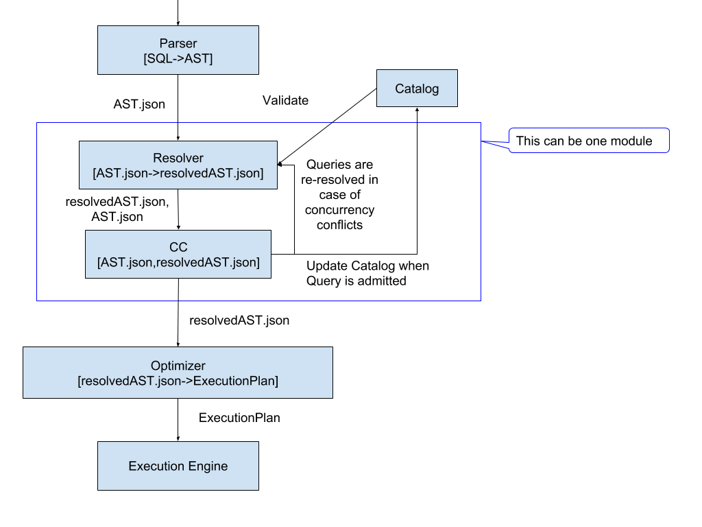

---
10/15/2018

Parser [Kevin, Matt]
+ Met with Jianqiao.
+ Worked on a Rust interface to call C++ function. 
+ Working on testing to cover SQLite parser.
+ Test SQLite queries in Quickstep's parser and figure out what can be parsed.
+ By thanksgiving: produce ASTs for the quickstep surface, test json serialization and cleanly separate the parser.

Catalog, Storage Manager [Robert]
+ Catalog done by by the end of the week.
+ Simple select query without predicates can run now on the storage manager.
+ By thanksgiving run simple select * query (no aggregations).

Optimizer [Yannis]
+ Working through the Quickstep's code. No new progress to report.

General
+ Target: TPC-DS run on Hustle.
+ Architecture Comments: Keep CC and resolver under a latch to avoid races. In the future we should push CC downstream.

CRISP Report
+ Two key operations for ML applications, matrix multiplication (sparsity), transpose, matrix algebra.
+ We should support matrix operations and we should start from read, write, transpose a matrix.
+ CAPA project: Simple filter query on a key value (key: 8bytes, value: 100bytes) and see what the memory can do.

---
10/08/2018

General [Yannis]
+ Proposed module design, flow and input and ouput of modules.

---
10/01/2018

Parser [Matt, Kevin]
+ Decided to re-implement the parser.
+ Examine if we can use Quickstep's parser.
+ Use SQLite parser's test to verify our parser, start by successfully 
parsing the 7 million test queries.

Catalog, Hustle[Robert]
+ Create a skeleton implementation (coordinate with Matt and Kevin) that creates and deletes a table.
+ The Rust side of the catalog is almost done, run into a garbage collection problem. 
Arguments passed from C++ to Rust are garbage collected.
+ Need different concurrency control for stats and schema.
+ Catalog API will return a token that could be used to return the entire catalog or an id
and the catalog module will store snapshots of the catalog.

Optimizer [Yannis]
+ Quickstep's optimizer is a viable choice and we should use it.

General
+ We need locks on views.
+ Parser should create a AST and only do grammar validation. 
+ CC module will verify the columns and tables and grab the necessary locks.
---
09/24/2018

Storage Manager [Aarati]
+ Looked into the storage manager and about global indices.
+ Will write up and share the storage manager's design.

Parser [Matt, Kevin]
+ Continuing work to isolate the parser by replacing calls to the code generator
  with calls to custom functions.
+ Using SQLite's parser might be not as easy as we hopped. Should we build our own and use SQLite's
SQLite's test suite to ensure with support the same surface?
+ Take a couple of days to decide if we should modify SQLite's parser. Explore the
contents of the parser's classes and evaluate how to add a new function to the parser.
+ Worked on defining the schema with Robert.

[Robert]
+ Did meetings to define the structure of the Catalog and the help with the Parser.
+ Will work on the first implementation and definition of the API of the Catalog.

Optimizer [Yannis]
+ Looked at Quickstep's optimizer as an alternative to starting from scratch.
+ Evaluating Quickstep's optimizer, will work on separating Quickstep's optimizer from the parser
 and catalog.

General
+ We should restrict the languages in order to not require heavy runtimes, we should use Rust, C, C++.
+ Follow Rust's model for error handling, define custom error codes and handle then explicitly.
